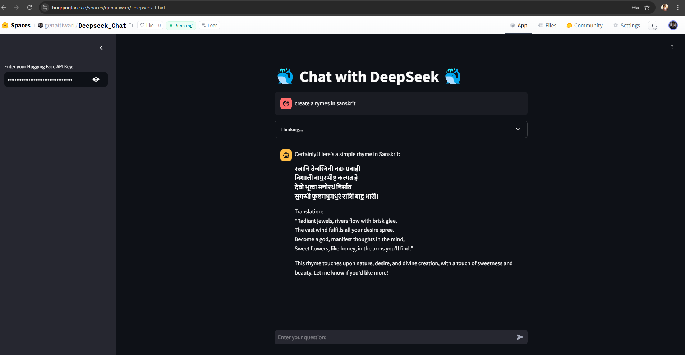

Below is the content for a `README.md` file that you can include in your project to provide an overview of the code, its requirements, and how to use it:

---

# 🐳 Chat with DeepSeek 🐳

This is a Streamlit-based web application that allows users to interact with the **DeepSeek-R1-Distill-Qwen-32B** model hosted on Hugging Face. The application uses the Hugging Face Inference API to generate responses to user queries.

---
## 🧑‍💻 Author
Sachin Tiwari

---
## 🚀 Features

- **Interactive Chat Interface**: Users can input questions and receive responses from the DeepSeek model.
- **Thinking Process Visualization**: If the model's response contains `<think>` tags, the app displays the thinking process in an expandable section.
- **Secure API Key Input**: Users can securely input their Hugging Face API key to authenticate and use the model.

---

## 📋 Requirements

To run this application, you need the following Python packages:

- `streamlit`: For building the web interface.
- `huggingface_hub`: For interacting with the Hugging Face Inference API.

You can install the required packages using the following command:

```bash
pip install streamlit huggingface_hub
```

---

## 🛠️ How to Use

1. **Clone the Repository**:
   ```bash
   git clone <https://github.com/aitiwari/Deepseek_Chat_HF.git>
   cd <Deepseek_Chat_HF>
   ```

2. **Run the Application**:
   Start the Streamlit app by running the following command:
   ```bash
   streamlit run app.py
   ```

3. **Enter Your Hugging Face API Key**:
   - Open the app in your browser.
   - In the sidebar, enter your Hugging Face API key in the provided input box.

4. **Chat with DeepSeek**:
   - Once the API key is entered, you can start chatting with the DeepSeek model by typing your questions in the chat input box.

---

## 🧑‍💻 Code Overview

The application is built using the following components:

- **Streamlit UI**: The interface is created using Streamlit, with a sidebar for API key input and a main area for chat interactions.
- **Hugging Face Inference API**: The `InferenceClient` from the `huggingface_hub` library is used to send requests to the DeepSeek model.
- **Response Parsing**: The app checks for `<think>` tags in the model's response and displays the thinking process separately.

Here’s the main code snippet:

```python
import streamlit as st
from huggingface_hub import InferenceClient

# Streamlit UI
st.title("🐳 Chat with DeepSeek 🐳")

with st.sidebar:
    # Input box for user to enter their Hugging Face API key
    api_key = st.text_input("Enter your Hugging Face API Key:", type="password")

if api_key:
    # Initialize the InferenceClient with the user-provided API key
    client = InferenceClient(api_key=api_key)

    # Input box for user to enter their question
    user_input = st.chat_input("Enter your question:")
    

    if user_input:
        # Prepare the messages for the model
        messages = [
            {
                "role": "user",
                "content": user_input
            }
        ]
        with st.chat_message("user"):
            st.write(user_input)

        # Get the completion from the model
        completion = client.chat.completions.create(
            model="deepseek-ai/DeepSeek-R1-Distill-Qwen-32B", 
            messages=messages, 
        )

        # Get the model's response
        response = completion.choices[0].message['content']

        # Check if the response contains <think> tags
        if "<think>" in response and "</think>" in response:
            # Extract content within <think> tags
            think_content = response.split("<think>")[1].split("</think>")[0].strip()
            # Display the thinking content in an expander
            with st.expander("Thinking..."):
                st.write(think_content)

            # Extract the rest of the response (outside <think> tags)
            rest_of_response = response.split("</think>")[1].strip()
            # Display the rest of the response with an AI icon
            with st.chat_message("ai"):
                st.write(rest_of_response)
        else:
            # If no <think> tags, display the entire response with an AI icon
            with st.chat_message("ai"):
                st.write(rest_of_response)
else:
    with st.sidebar:
        st.warning("Please enter your Hugging Face API Key to proceed.")
```

---

## Output
- **Huggingface Space**: [Link](https://huggingface.co/spaces/genaitiwari/Deepseek_Chat)


## 📝 Notes

- **API Key Security**: Ensure that your Hugging Face API key is kept secure and not shared publicly.
- **Model Limitations**: The responses generated by the DeepSeek model are based on its training data and may not always be accurate or complete.

---

## 📜 License

This project is licensed under the MIT License. See the [LICENSE](LICENSE) file for details.

---
